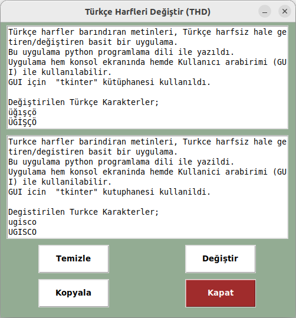

# Türkçe Harfleri Değiştir (THD)

Türkçe harfler barındıran metinleri, Türkçe harfsiz hale getiren/değiştiren basit bir uygulama.
Bu uygulama python programlama dili ile yazıldı.
Uygulama hem konsol ekranında hemde Kullanıcı arabirimi (GUI) ile kullanılabilir.
GUI için  **tkinter** kütüphanesi kullanıldı.

Değiştirilen Türkçe Karakterler;

üğışçö

ÜĞİŞÇÖ

Uygulamanın Ekran Görüntüsü;

